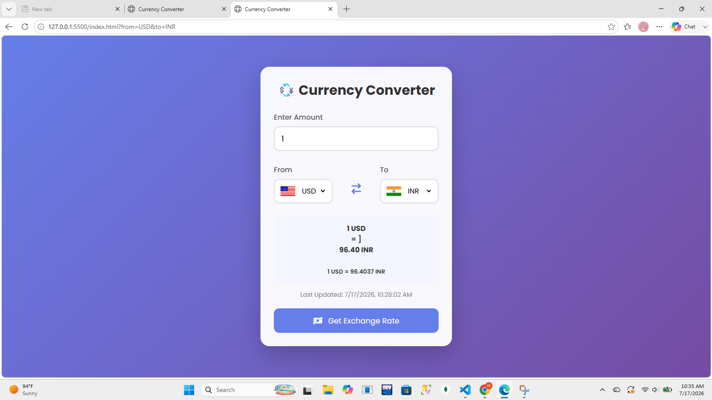

# 💱 Currency Converter

A modern and responsive Currency Converter built with **HTML, CSS, and JavaScript**.

It fetches real-time exchange rates using the **ExchangeRate API** and allows users to convert between multiple international currencies with dynamic flag updates.

---

## 📸 Project Preview

<p align="center">
  
</p>

---

## ✨ Features

- 🌍 Real-time Currency Conversion
- 💵 Supports 160+ Currencies
- 🚩 Dynamic Country Flags
- 🔄 Live Exchange Rates
- 📱 Responsive Design
- ⚡ Fast & Lightweight
- 🎨 Modern UI

---

## 🛠 Technologies Used

- HTML5
- CSS3
- JavaScript (ES6)
- ExchangeRate API
- FlagsAPI
- Font Awesome

---

## 📂 Project Structure

```
Currency-Converter/
│
├── index.html
├── style.css
├── first.js
├── codes.js
├── README.md
└── assets/
    └── currency-converter.png
```

---

## 🚀 How to Run

1. Clone the repository

```
git clone https://github.com/maryamcodes45/Currency-Converter-Project-.git
```

2. Open the project folder.

3. Run **index.html** in your browser.

---

## 🌟 Future Improvements

- Dark Mode
- Currency Search
- Swap Animation
- Conversion History
- Favorite Currencies

---

## 👩‍💻 Developed By

**Maryam Saleem**

GitHub: https://github.com/maryamcodes45

---

⭐ If you like this project, don't forget to give it a Star.